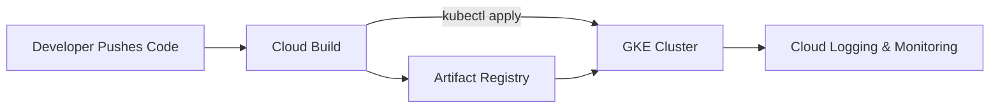
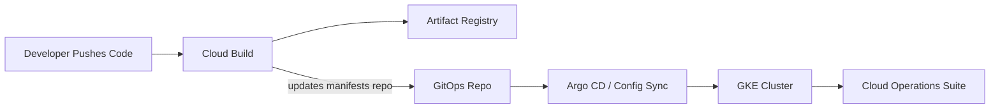

# 🚀 levelUPGitOps  
### Modern DevOps Workflow with GKE, Cloud Build, and GitOps  

---

## 🎯 Project Overview  

**levelUPGitOps** is a **group DevOps project** developed as part of the **LVL UP Program** under the patronage of the **Perspektywy Foundation**.  
The initiative aims to demonstrate a complete **modern CI/CD and GitOps workflow** within **Google Cloud Platform (GCP)** using containerized applications, automated pipelines, and observability best practices.  

The solution implements a fully managed DevOps lifecycle:  
> **Commit → Build → Deploy → Monitor → Optimize**

---

## ⚙️ Objectives  

- Build a **Google Kubernetes Engine (GKE)** cluster for container orchestration.  
- Set up **Cloud Build** to automate Docker image creation and deployment.  
- Store and manage images in **Artifact Registry**.  
- Enable **GitOps-style deployment** directly from the repository.  
- Integrate **Cloud Operations Suite** for monitoring, logging, and alerting.  
- Apply **IAM best practices** to secure the pipeline and infrastructure.  

---

## 🧩 Technologies & Tools  

| Category | GCP Services / Tools | Artifacts / Config |
|-----------|----------------------|--------------------|
| **Infrastructure & Orchestration** | Google Kubernetes Engine (GKE), IAM | `k8s/*.yaml` |
| **CI/CD Automation** | Cloud Build, Artifact Registry, Cloud Build Triggers | `.cloudbuild/cloudbuild.yaml` |
| **Application Layer** | Containerized REST API (e.g. Python / Java / Node.js) | `app/Dockerfile` |
| **Monitoring & Logging** | Cloud Monitoring, Cloud Logging | Dashboards, Metrics, Alerts |

---

## 🗂 Repository Structure  

```
levelUPGitOps/
├── app/                    # Application source code & Dockerfile
│   └── Dockerfile
├── k8s/                    # Kubernetes manifests
│   ├── namespace.yaml
│   ├── deployment.yaml
│   ├── service.yaml
│   └── hpa.yaml
├── .cloudbuild/            # Cloud Build pipeline configuration
│   └── cloudbuild.yaml
└── README.md
```

---

## 🧭 Architecture Diagram  

### CI/CD Workflow (MVP)



### Stage 2 – GitOps Expansion



---

## 👩‍💻 Team Composition & Responsibilities  

This project was delivered collaboratively by **Project 9 – Group 4** within the **LVL UP Program**.  
Each member contributed to a distinct part of the DevOps lifecycle to ensure a real-world division of responsibilities.  

| Member | Role / Responsibility | Key Deliverables |
|---------|-----------------------|------------------|
| **Justyna Gajdek (JG)** | **Monitoring & Observability** | Cloud Logging & Monitoring setup, custom log-based metrics, dashboard visualization, alerting policies, project documentation. |
| **Joanna Kogut (JK)** | **CI/CD Pipeline Engineer** | Cloud Build configuration, automated triggers, Docker image build & deployment logic. |
| **Urszula Kamińska (UK)** | **Application Developer** | REST API implementation, Dockerfile creation, GitHub repository setup, initial tests. |
| **Magdalena Krupa (MK)** | **Infrastructure Engineer** | GKE cluster provisioning, Kubernetes manifests (Deployment, Service, HPA), cluster connectivity. |
| **Natalia Wróbel (NW)** | **IAM & Security Specialist** | IAM policy design, role assignment, access control for Cloud Build and GKE integration. |

> Task management was coordinated via **Trello**, reflecting real Agile workflow stages: *To-Do → In Progress → Done*.

---

## ✅ Definition of Done (DoD)

- [x] Source code and manifests versioned in GitHub.  
- [x] Automated Docker image build via Cloud Build.  
- [x] Image push to Artifact Registry.  
- [x] Successful deployment to GKE using CI/CD trigger.  
- [x] Observability pipeline in place (Logs + Metrics + Alerts).  
- [x] IAM principles of least privilege applied.  
- [x] Comprehensive documentation prepared (this README).  

---

## 🏗 Cloud Build Configuration  

**`.cloudbuild/cloudbuild.yaml`**

```yaml
substitutions:
  _REGION: "europe-north1"
  _REPO:   "app"
  _NS:     "demo"

steps:
  # 1. Build Docker image
  - name: "gcr.io/cloud-builders/docker"
    args: ["build", "-t", "${_REGION}-docker.pkg.dev/$PROJECT_ID/${_REPO}/app:${SHORT_SHA}", "./app"]

  # 2. Push image to Artifact Registry
  - name: "gcr.io/cloud-builders/docker"
    args: ["push", "${_REGION}-docker.pkg.dev/$PROJECT_ID/${_REPO}/app:${SHORT_SHA}"]

  # 3. Patch image reference in deployment.yaml
  - name: "gcr.io/cloud-builders/gcloud"
    entrypoint: bash
    args:
      - "-c"
      - |
        sed -i "s|REGION-docker.pkg.dev/PROJECT_ID/app/app:\$_IMAGE_TAG|${_REGION}-docker.pkg.dev/$PROJECT_ID/${_REPO}/app:${SHORT_SHA}|g" k8s/deployment.yaml

  # 4. Connect to GKE and deploy
  - name: "gcr.io/cloud-builders/gcloud"
    args: ["container", "clusters", "get-credentials", "kubernetes-cluster1", "--zone", "europe-north1-b", "--project", "$PROJECT_ID"]
  - name: "gcr.io/cloud-builders/kubectl"
    args: ["apply", "-f", "k8s/"]

images:
  - "${_REGION}-docker.pkg.dev/$PROJECT_ID/${_REPO}/app:${SHORT_SHA}"
```

---

## 🧱 Kubernetes Manifests (Simplified Example)

**`k8s/deployment.yaml`**
```yaml
apiVersion: apps/v1
kind: Deployment
metadata:
  name: app
  namespace: demo
spec:
  replicas: 2
  selector:
    matchLabels:
      app: app
  template:
    metadata:
      labels:
        app: app
    spec:
      containers:
        - name: app
          image: europe-north1-docker.pkg.dev/PROJECT_ID/app/app:latest
          ports:
            - containerPort: 8080
```

**`k8s/service.yaml`**
```yaml
apiVersion: v1
kind: Service
metadata:
  name: app-svc
  namespace: demo
spec:
  type: LoadBalancer
  selector:
    app: app
  ports:
    - port: 80
      targetPort: 8080
```

---

## 📊 Monitoring & Observability  

### Implementation Steps  
1. **Cloud Logging** – Collect and analyze GKE container logs via Logs Explorer.  
2. **Log-Based Metrics** – Custom metric to count HTTP 5xx errors for reliability tracking.  
3. **Dashboards** – CPU, Memory, Pod Restarts, and `app_errors_5xx` visualization.  
4. **Alerts** – Configured thresholds for:  
   - Pod restarts > 3 in 5 minutes.  
   - Error rate > 0 for 5 consecutive minutes.  

### Outcome  
Cloud Operations provides unified visibility into system health, performance bottlenecks, and real-time alerting.

---

## 🔐 IAM Configuration Summary  

- **Cloud Build Service Account:**  
  - `roles/artifactregistry.writer`  
  - `roles/container.developer`  
  - `roles/iam.serviceAccountUser`  
- **IAM Principle:** Least privilege with separation between CI/CD and runtime environments.  

---

## 💰 Cost Optimization Practices  

- Used **Autopilot cluster mode** to minimize idle node costs.  
- Limited resource requests in deployments (CPU/Memory).  
- Reduced log retention to 30 days.  
- Disabled LoadBalancer when not in use.  
- Billing data exported to **BigQuery** for transparency and reporting.  

---

## 🧪 Cluster Verification (Cloud Shell Example)

```bash
# Authenticate
gcloud container clusters get-credentials kubernetes-cluster1 --zone europe-north1-b

# Apply manifests
kubectl apply -f k8s/

# Check deployments
kubectl get deployments -n demo
kubectl get pods -n demo
kubectl get svc -n demo
```

---

## 🏁 Final Remarks  

This project showcases the **complete DevOps lifecycle** in a cloud-native environment, emphasizing:  
- **Automation**,  
- **Scalability**,  
- **Security**, and  
- **Observability**.  

It reflects a real-world team collaboration workflow used in professional cloud projects, integrating infrastructure management, CI/CD pipelines, and proactive monitoring — all built and documented by the **LVL UP GitOps Team**.

---

## 👩‍💻 Authors  
**levelUP GitOps Team – Project 9, Group 4 (LVL UP Program)**  
Under the patronage of **Perspektywy Foundation** 💡  

- **Justyna Gajdek** – Monitoring & Observability  
- **Joanna Kogut** – CI/CD & Cloud Build  
- **Urszula Kamińska** – Application Development  
- **Magdalena Krupa** – Infrastructure (GKE)  
- **Natalia Wróbel** – IAM & Security  

---
