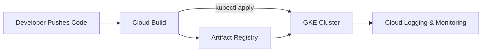
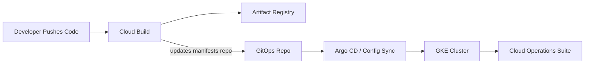

# 🚀 levelUPGitOps  
### Modern DevOps Workflow with GKE, Cloud Build, and GitOps  

---

## 🎯 Project Overview  

**levelUPGitOps** is a **group DevOps project** developed as part of the **LVL UP Program** under the patronage of the **Perspektywy Foundation**.  
The initiative aims to demonstrate a complete **modern CI/CD and GitOps workflow** within **Google Cloud Platform (GCP)** using containerized applications, automated pipelines, and observability best practices.  

The solution implements a fully managed DevOps lifecycle:  
> **Commit → Build → Deploy → Monitor → Optimize**

---

## ⚙️ Objectives  

- Build a **Google Kubernetes Engine (GKE)** cluster for container orchestration.  
- Set up **Cloud Build** to automate Docker image creation and deployment.  
- Store and manage images in **Artifact Registry**.  
- Enable **GitOps-style deployment** directly from the repository.  
- Integrate **Cloud Operations Suite** for monitoring, logging, and alerting.  
- Apply **IAM best practices** to secure the pipeline and infrastructure.  

---

## 🧩 Technologies & Tools  

| Category | GCP Services / Tools | Artifacts / Config |
|-----------|----------------------|--------------------|
| **Infrastructure & Orchestration** | Google Kubernetes Engine (GKE), IAM | `k8s/*.yaml` |
| **CI/CD Automation** | Cloud Build, Artifact Registry, Cloud Build Triggers | `cloudbuild.yaml` |
| **Application Layer** | Backend: Python REST API, Frontend: Nginx static | `app/backend/*`, `app/frontend/*` |
| **Monitoring & Logging** | Cloud Monitoring, Cloud Logging | Dashboards, Metrics, Alerts |

---

## 🗂 Repository Structure  

```
levelUPGitOps/
├── app/ # Application source code
│ ├── backend/ # Backend service (Python REST API)
│ │ ├── src/
│ │ │ └── main.py
│ │ ├── Dockerfile
│ │ └── requirements.txt
│ └── frontend/ # Frontend service (Nginx-based)
│ ├── src/
│ ├── Dockerfile
│ └── nginx.conf
│
├── k8s/ # Kubernetes manifests
│ ├── namespace.yaml
│ ├── backend-deploy.yaml
│ ├── backend-service.yaml
│ ├── frontend-deploy.yaml
│ └── frontend-service.yaml
│
├── 01_Cloud_Logging_Logs_Explorer.png # Proof – Logs Explorer
├── 02_Monitoring_Custom_Metrics.png # Proof – Custom metrics
├── 03_Monitoring_Custom_Dashboard.png # Proof – Dashboard
├── 04_Monitoring_Alert_Policy_Example.png # Proof – Alert policy
│
├── README_PROOF_MONITORING.md # Detailed monitoring proofs
├── cloudbuild.yaml # Cloud Build pipeline
├── docker-compose.yml # Local compose (optional)
├── .gitignore
├── LICENSE
└── README.md # Main project documentation
```

---

## 🧭 Architecture Diagram  

### CI/CD Workflow (MVP)



### Stage 2 – GitOps Expansion



---

## 👩‍💻 Team Composition & Responsibilities  

This project was delivered collaboratively by **Project 9 – Group 4** within the **LVL UP Program**.  
Each member contributed to a distinct part of the DevOps lifecycle to ensure a real-world division of responsibilities.  

| Member | Role / Responsibility | Key Deliverables |
|---------|-----------------------|------------------|
| **Justyna Gajdek (JG)** | **Monitoring & Observability** | Cloud Logging & Monitoring setup, custom log-based metrics, dashboard visualization, alerting policies, project documentation. |
| **Joanna Kogut (JK)** | **CI/CD Pipeline Engineer** | Cloud Build configuration, automated triggers, Docker image build & deployment logic. |
| **Urszula Kamińska (UK)** | **Application Developer** | REST API implementation, Dockerfile creation, GitHub repository setup, initial tests. |
| **Magdalena Krupa (MK)** | **Infrastructure Engineer** | GKE cluster provisioning, Kubernetes manifests (Deployment, Service, HPA), cluster connectivity. |
| **Natalia Wróbel (NW)** | **IAM & Security Specialist** | IAM policy design, role assignment, access control for Cloud Build and GKE integration. |

> Task management was coordinated via **Trello**, reflecting real Agile workflow stages: *To-Do → In Progress → Done*.

---

## ✅ Definition of Done (DoD)

- [x] Source code and manifests versioned in GitHub.  
- [x] Automated Docker image build via Cloud Build.  
- [x] Image push to Artifact Registry.  
- [x] Successful deployment to GKE using CI/CD trigger.  
- [x] Observability pipeline in place (Logs + Metrics + Alerts).  
- [x] IAM principles of least privilege applied.  
- [x] Comprehensive documentation prepared (this README).  

---

## 📌 Application Overview - Cloud Vulnerability Tracker

The application provides a simple interface for tracking the latest Google Cloud security bulletins. It automatically gathers vulnerability information (including CVEs), determines whether remediation is required from Google Cloud, the customer, or both, and displays the results in a searchable, filterable table.

The system consists of a FastAPI backend that scrapes and processes bulletin data, and a lightweight frontend built with HTML, JavaScript, and Tailwind CSS. Both components run in Docker containers, with frontend–backend communication routed through `/api`, ensuring consistent behavior in local Docker Compose as well as in GKE deployments (via GitOps and Cloud Build).

---

## 🏗 Cloud Build Configuration  
**`cloudbuild.yaml`** – pipeline builds both backend and frontend containers, pushes them to Artifact Registry, and applies updated Kubernetes manifests in the demo namespace.

> Frontend can be added with a second build/push block or a separate trigger (GitOps-friendly).

```yaml
substitutions:
  _REGION: "europe-north1"
  _AR_REPO: "app"
  _NS: "demo"

steps:
  # 1️⃣ Build and push BACKEND image
  - name: "gcr.io/cloud-builders/docker"
    id: "Build backend image"
    args: [
      "build", "-t",
      "${_REGION}-docker.pkg.dev/$PROJECT_ID/${_AR_REPO}/backend:${SHORT_SHA}",
      "app/backend"
    ]
  - name: "gcr.io/cloud-builders/docker"
    id: "Push backend image"
    args: [
      "push",
      "${_REGION}-docker.pkg.dev/$PROJECT_ID/${_AR_REPO}/backend:${SHORT_SHA}"
    ]

  # 2️⃣ Build and push FRONTEND image
  - name: "gcr.io/cloud-builders/docker"
    id: "Build frontend image"
    args: [
      "build", "-t",
      "${_REGION}-docker.pkg.dev/$PROJECT_ID/${_AR_REPO}/frontend:${SHORT_SHA}",
      "app/frontend"
    ]
  - name: "gcr.io/cloud-builders/docker"
    id: "Push frontend image"
    args: [
      "push",
      "${_REGION}-docker.pkg.dev/$PROJECT_ID/${_AR_REPO}/frontend:${SHORT_SHA}"
    ]

  # 3️⃣ Get GKE credentials
  - name: "gcr.io/cloud-builders/gcloud"
    id: "Get GKE credentials"
    args: [
      "container", "clusters", "get-credentials",
      "kubernetes-cluster1",
      "--zone", "europe-north1-b",
      "--project", "$PROJECT_ID"
    ]

  # 4️⃣ Apply namespace and manifests
  - name: "gcr.io/cloud-builders/kubectl"
    id: "Apply all manifests"
    args: ["apply", "-f", "k8s/"]

  # 5️⃣ Update backend and frontend images dynamically
  - name: "gcr.io/cloud-builders/kubectl"
    id: "Update backend image"
    args: [
      "-n", "${_NS}",
      "set", "image",
      "deployment/backend",
      "backend=${_REGION}-docker.pkg.dev/$PROJECT_ID/${_AR_REPO}/backend:${SHORT_SHA}"
    ]
  - name: "gcr.io/cloud-builders/kubectl"
    id: "Update frontend image"
    args: [
      "-n", "${_NS}",
      "set", "image",
      "deployment/frontend",
      "frontend=${_REGION}-docker.pkg.dev/$PROJECT_ID/${_AR_REPO}/frontend:${SHORT_SHA}"
    ]

images:
  - "${_REGION}-docker.pkg.dev/$PROJECT_ID/${_AR_REPO}/backend:${SHORT_SHA}"
  - "${_REGION}-docker.pkg.dev/$PROJECT_ID/${_AR_REPO}/frontend:${SHORT_SHA}"

```

---

## 🧱 Kubernetes Manifests (Simplified Example)

**`k8s/backend-deploy.yaml`**
```yaml
apiVersion: apps/v1
kind: Deployment
metadata:
  name: backend
  namespace: demo
spec:
  replicas: 2
  selector:
    matchLabels:
      app: backend
  template:
    metadata:
      labels:
        app: backend
    spec:
      containers:
        - name: backend
          image: europe-north1-docker.pkg.dev/PROJECT_ID/app/backend:latest
          ports:
            - containerPort: 5000
          livenessProbe:
            httpGet:
              path: /health
              port: 5000
            initialDelaySeconds: 10
            periodSeconds: 30
          readinessProbe:
            httpGet:
              path: /ready
              port: 5000
            initialDelaySeconds: 5
            periodSeconds: 10
```

**`k8s/frontend-service.yaml`**
```yaml
apiVersion: v1
kind: Service
metadata:
  name: frontend-service
  namespace: demo
spec:
  type: LoadBalancer
  selector:
    app: frontend
  ports:
    - name: http
      port: 80
      targetPort: 80
```

---

## 📊 Monitoring & Observability  

### Implementation Steps  
1. **Cloud Logging** – Collect and analyze GKE container logs via Logs Explorer.  
2. **Log-Based Metrics** – Custom metric to count HTTP 5xx errors for reliability tracking.  
3. **Dashboards** – CPU, Memory, Pod Restarts, and `app_errors_5xx` visualization.  
4. **Alerts** – Configured thresholds for:  
   - Pod restarts > 3 in 5 minutes.  
   - Error rate > 0 for 5 consecutive minutes.  

### Outcome  
Cloud Operations provides unified visibility into system health, performance bottlenecks, and real-time alerting.

For detailed monitoring and logging proofs (screenshots, metrics, dashboards, alerts), see 👉 [**README_PROOF_MONITORING.md**](README_PROOF_MONITORING.md)


---

## 🔐 IAM Configuration Summary  

- **Cloud Build Service Account:**  
  - `roles/artifactregistry.writer`  
  - `roles/container.developer`  
  - `roles/iam.serviceAccountUser`  
- **IAM Principle:** Least privilege with separation between CI/CD and runtime environments.  

---

## 💰 Cost Optimization Practices  

- Used **standard GKE cluster (e2-micro nodes)** to minimize idle costs.  
- Implemented **Horizontal Pod Autoscaler (HPA)** for automatic scaling.  
- Reduced log retention to **30 days** for cost/visibility balance.  
- Disabled external **LoadBalancer** when not needed.  
- Optional: exported billing data to **BigQuery** for transparent reporting. 

---

## 🧪 Cluster Verification (Cloud Shell Example)

```bash
# Authenticate
gcloud container clusters get-credentials kubernetes-cluster1 --zone europe-north1-b

# Apply manifests
kubectl apply -f k8s/

# Check deployments
kubectl get deployments -n demo
kubectl get pods -n demo
kubectl get svc -n demo
```

---

## 🏁 Final Remarks  

This project showcases the **complete DevOps lifecycle** in a cloud-native environment, emphasizing:  
- **Automation**,  
- **Scalability**,  
- **Security**, and  
- **Observability**.  

It reflects a real-world DevOps collaboration model typical for enterprise environments — integrating infrastructure management, CI/CD automation, and proactive observability — all designed and delivered by the **LVL UP GitOps Team**.

---

## 👩‍💻 Authors  
**levelUP GitOps Team – Project 9, Group 4 (LVL UP Program)**  
Under the patronage of **Perspektywy Foundation** 💡  

- **Justyna Gajdek** – Monitoring & Observability  
- **Joanna Kogut** – CI/CD & Cloud Build  
- **Urszula Kamińska** – Application Development  
- **Magdalena Krupa** – Infrastructure (GKE)  
- **Natalia Wróbel** – IAM & Security  

---
