<h2>Proof of Implementation – GKE, Cloud Build CI/CD & GitOps</h2>

<h3><b>Purpose</b></h3>

This document provides evidence of the successful implementation of a complete DevOps pipeline on Google Cloud Platform.
It includes containerization, GKE, CI/CD, GitOps, monitoring, IAM, and cost analysis.

Each section contains a screenshot placeholder confirming that the respective stage of the pipeline is properly implemented.

<h3><b>Implementation Proofs</b></h3>

**1. Proof: GKE Cluster Deployment**

1.1. GKE Cluster Created
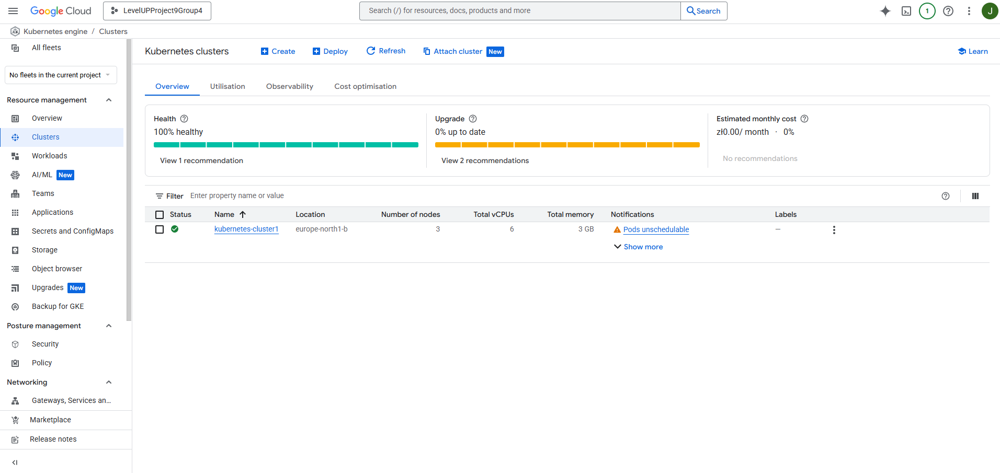

This confirms the creation of a fully functional Kubernetes cluster in Google Kubernetes Engine.

1.2. Node Pool Configuration
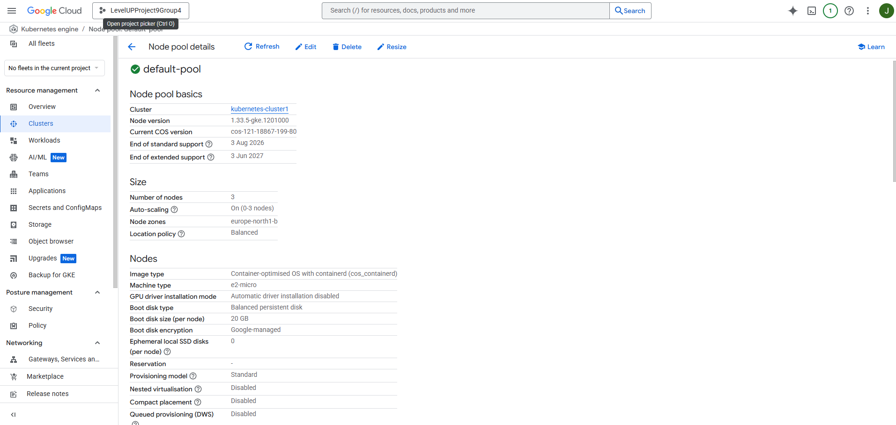

This validates correct configuration of compute resources.

**2. Proof: Containerized Application **

2.1. Application Repository (GitHub)
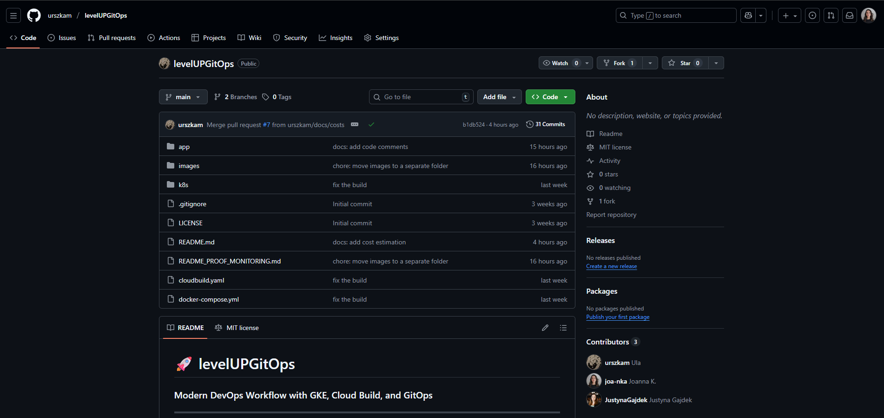

The application is stored in a GitHub repository serving as the single source of truth for code, container configuration, and deployment manifests.

The repository includes:
- application source code,
- Dockerfile,
- Kubernetes manifests,
- Cloud Build configuration,
- documentation files.

This validates that the project follows a Git-centric workflow consistent with GitOps principles.

2.2. Dockerfile (see in the GitHub repository)

The Dockerfile is stored and versioned directly in the GitHub repository.

This ensures:
- reproducible builds in Cloud Build,
- traceable changes to container build logic,
- transparent collaboration and review process.

Location: see in the GitHub repository

2.3. Kubernetes Manifests (see in the GitHub repository)

All Kubernetes deployment configurations (deployment.yaml, service.yaml, etc.) are kept in the same GitHub repository.

This enables:
- full GitOps-style deployment automation,
- clear version control of infrastructure,
- simplified rollout and rollback.

Location: see in the GitHub repository

**3. Proof: Artifact Registry – Docker Image Storage**

3.1. Artifact Registry Repository
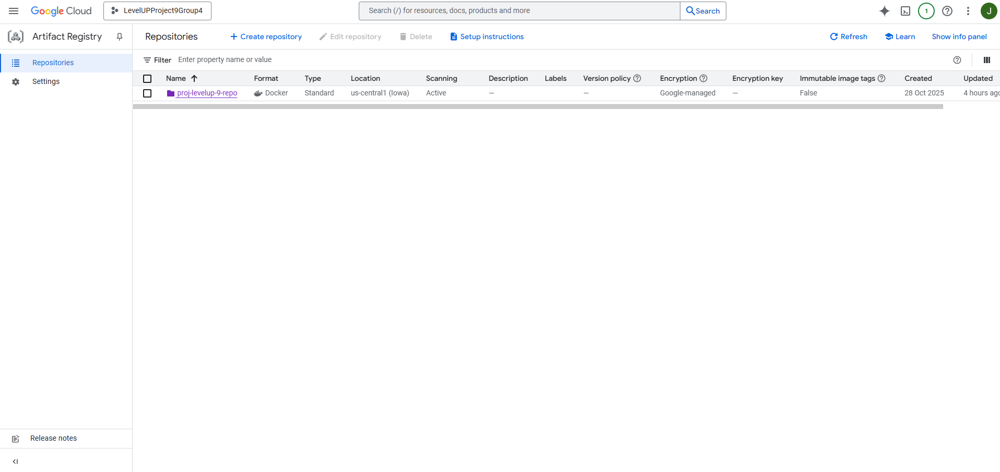

3.2. Uploaded Docker Images
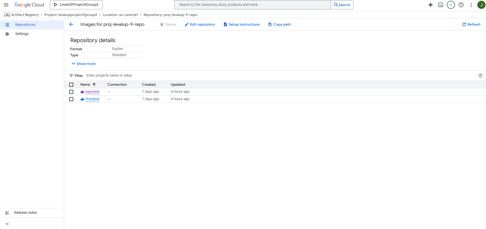

This confirms Cloud Build pushes Docker images to Artifact Registry correctly.

**4. Proof: Cloud Build – CI Pipeline**

4.1. Cloud Build Trigger
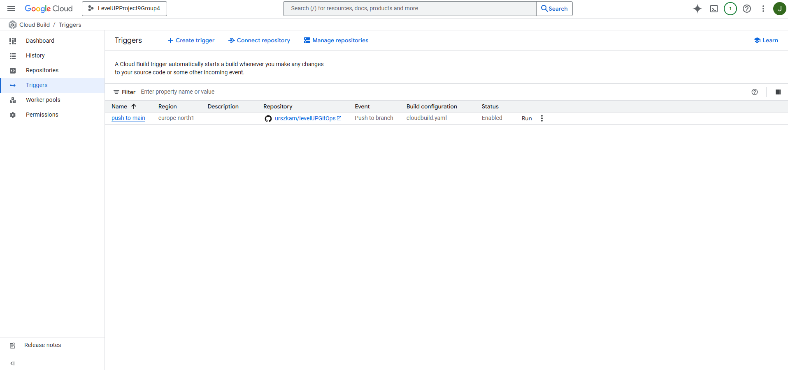

The trigger runs build → push → deploy automatically on each commit.

4.2. Cloud Build Execution History
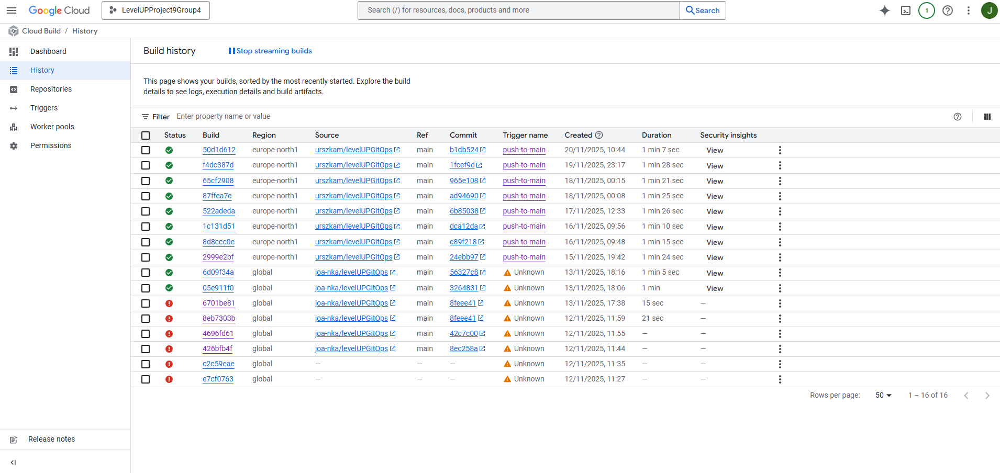

This confirms CI jobs are running correctly.

4.3. Build Logs
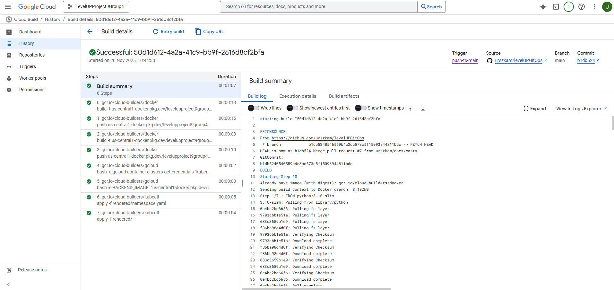

This proves the automated end-to-end pipeline functions properly.

**5. Proof: GitOps Deployment → GKE**

5.1. GKE Workloads – Deployed Resources

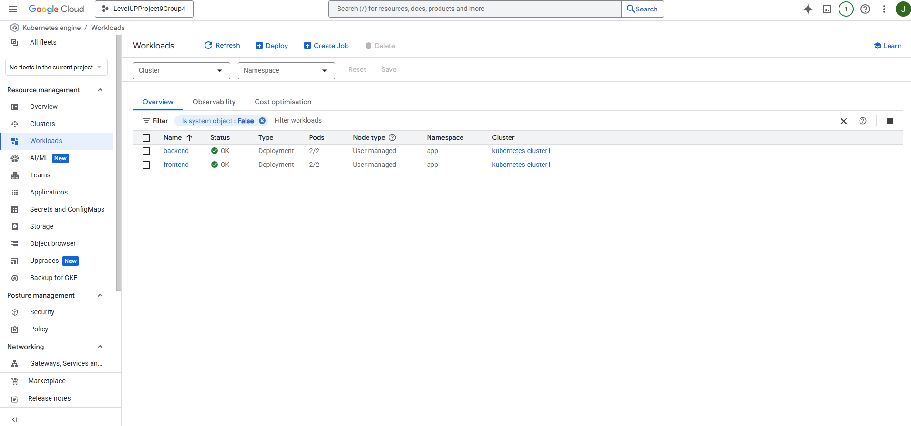

5.2. Running Pods
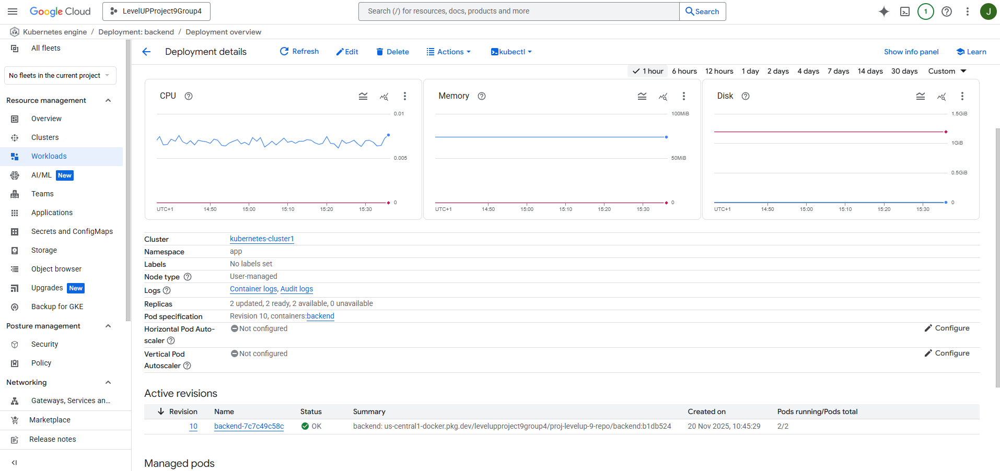

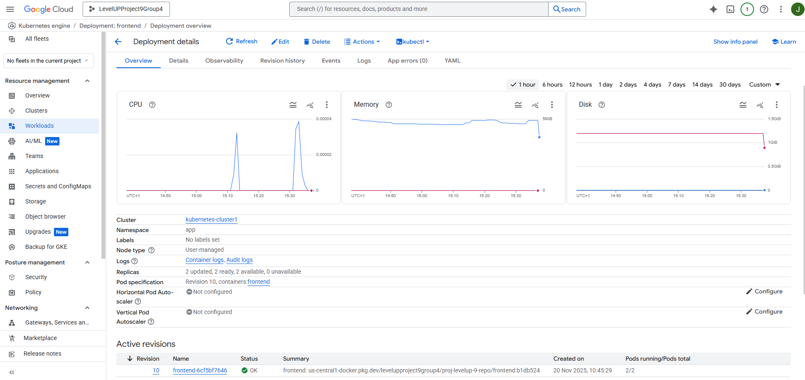

This confirms the application was successfully deployed to Kubernetes.

**6. Proof: IAM – Access & Permission Control**

6.1. IAM Roles for Team Members
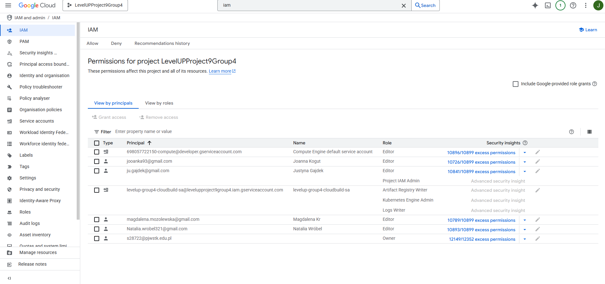

This validates correct access control configuration.

**7. Proof: Monitoring & Logging**

The full, detailed proof of the Monitoring and Logging implementation is provided in a separate file within this repository:

    README_PROOF_MONITORING.md

This file contains:\
- screenshots and evidence from Cloud Logging,\
- custom log-based metrics,\
- the GKE Application Health Monitoring Dashboard,\
- configured alerting policies,
- explanations and validation of observability setup.

This structure helps keep the main README clean while giving the monitoring section the space it requires.

**8. Proof: Team Collaboration & Project Coordination**

Effective collaboration and workflow coordination were ensured using communication and project-tracking tools.
The team worked together using:

Trello – for task management, planning and progress tracking.
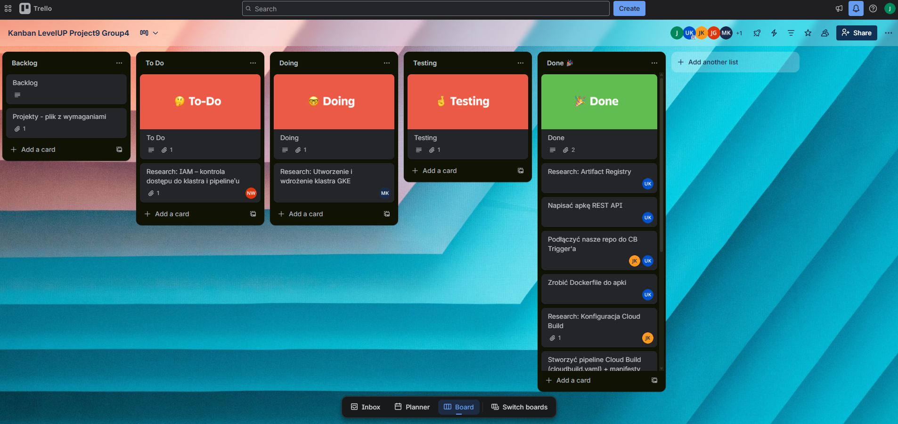

Google Meet – for online meetings and technical knowledge transfer.
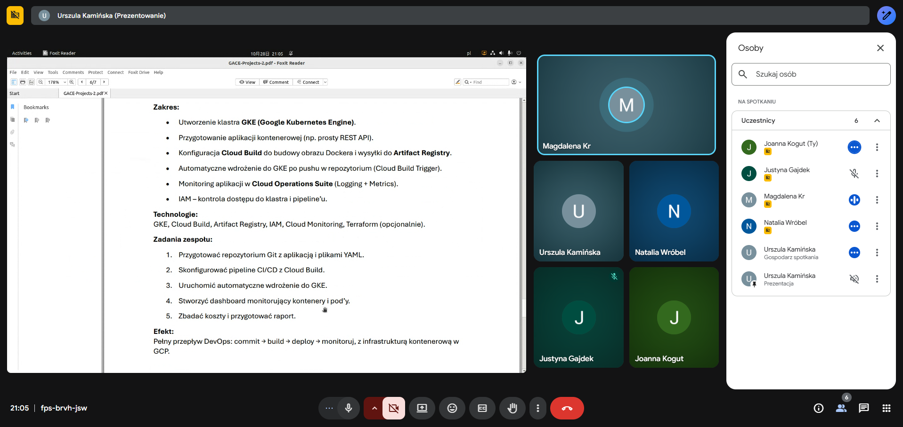

Slack – for communication and quick updates.
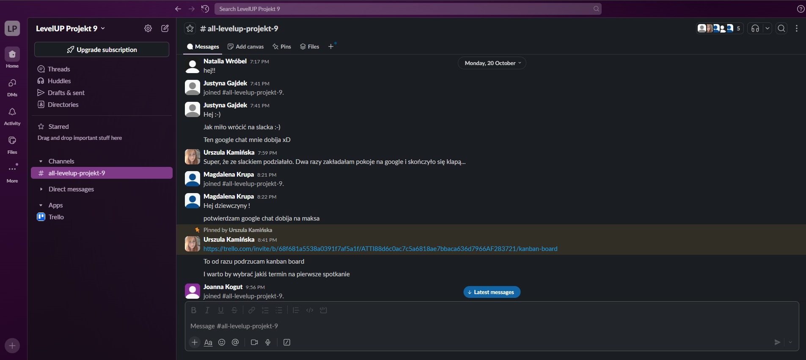

These tools enabled smooth coordination throughout all phases of the DevOps project, from planning to deployment and monitoring.

<h3><b>Summary</b></h3>

This project confirms a complete DevOps workflow implemented on GCP:

✔ Fully operational GKE cluster\
✔ Containerized application (Docker)\
✔ Artifact Registry for image storage\
✔ Automated Cloud Build CI/CD\
✔ GitOps deployment triggered by commits\
✔ Logging, metrics, dashboarding & alerts\
✔ IAM role-based access control\
✔ Team Collaboration & Project Coordination

A full DevOps flow is achieved: commit → build → deploy → observe.

